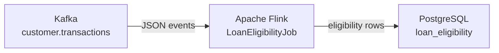

# kafka-flink-postgresdb-streamining

A reproducible streaming demo that reads customer transaction events from **Kafka** (Confluent Cloud or AWS MSK), applies a configurable **loan eligibility rule** in **Apache Flink**, and writes the result to **PostgreSQL**.

---

## What this project does



1. A customer transaction event arrives on a Kafka topic.
2. Flink parses the event and checks:
   - `amount >= 500 GBP`
   - `transaction_status = APPROVED`
   - `account_status = ACTIVE`
3. The eligibility decision (`ELIGIBLE` or `NOT_ELIGIBLE`) is written to PostgreSQL.

All thresholds and connection settings are driven by environment variables — no code changes are needed to switch between local Kafka, Confluent Cloud, or AWS MSK.

---

## Tech stack

| Layer           | Technology                                        |
|-----------------|---------------------------------------------------|
| Stream source   | Apache Kafka (Confluent Cloud / AWS MSK / local)  |
| Stream processor| Apache Flink 1.18 (local JVM or Flink cluster)   |
| Sink            | PostgreSQL 16 (Docker / Neon / Supabase)          |
| Language        | Java 17                                           |
| Build tool      | Maven 3.9+                                        |
| Local infra     | Docker Compose                                    |

---

## Repository layout

```
kafka-flink-postgresdb-streamining/
├── pom.xml                              # Maven build (fat JAR)
├── docker-compose.yml                   # Local PostgreSQL
├── config/
│   └── application.yml                  # Config reference (comments only)
├── src/main/
│   ├── java/com/example/flink/
│   │   ├── LoanEligibilityJob.java      # Main entry point
│   │   ├── config/AppConfig.java        # Env-var / YAML config reader
│   │   ├── model/
│   │   │   ├── TransactionEvent.java    # Kafka input POJO
│   │   │   └── LoanEligibilityResult.java
│   │   ├── rule/LoanEligibilityRule.java
│   │   ├── function/EligibilityMapFunction.java
│   │   └── sink/LoanEligibilityJdbcSink.java
│   └── resources/
│       ├── application.yml              # Runtime config (env-var backed)
│       └── log4j2.properties
├── docs/
│   ├── architecture.md                  # Mermaid diagram + component guide
│   ├── postgres-schema.sql              # Table + indexes DDL
│   ├── local-setup.md                   # Step-by-step local run guide
│   ├── confluent-cloud-setup.md         # Confluent Cloud Kafka setup
│   └── aws-msk-setup.md                 # AWS MSK auth variants
└── scripts/
    └── produce-sample-events.sh         # Sends 3 test events to Kafka
```

---

## Quick start

### Prerequisites
- Java 17 (`java -version`)
- Maven 3.9+ (`mvn -version`)
- Docker Desktop
- A Kafka cluster — Confluent Cloud trial or local Kafka

### 1. Start PostgreSQL

```bash
docker compose up -d postgres
```

The `loan_eligibility` table is created automatically on first start.

### 2. Set environment variables

```bash
# Confluent Cloud example
export KAFKA_BOOTSTRAP_SERVERS=pkc-xxxxx.us-east-1.aws.confluent.cloud:9092
export KAFKA_SECURITY_PROTOCOL=SASL_SSL
export KAFKA_SASL_MECHANISM=PLAIN
export KAFKA_SASL_JAAS_CONFIG='org.apache.kafka.common.security.plain.PlainLoginModule required username="API_KEY" password="API_SECRET";'
export KAFKA_TRANSACTIONS_TOPIC=customer.transactions

# PostgreSQL (local Docker defaults — change for Neon/Supabase)
export POSTGRES_URL=jdbc:postgresql://localhost:5432/loan_db
export POSTGRES_USERNAME=flink
export POSTGRES_PASSWORD=flink
```

For plain local Kafka you only need `KAFKA_BOOTSTRAP_SERVERS`.

### 3. Build

```bash
mvn clean package -DskipTests
```

### 4. Run

```bash
java -jar target/kafka-flink-postgresdb-streaming-1.0.0-SNAPSHOT.jar
```

### 5. Produce sample events

```bash
chmod +x scripts/produce-sample-events.sh
./scripts/produce-sample-events.sh
```

### 6. Verify results

```bash
psql -h localhost -U flink -d loan_db \
  -c "SELECT customer_id, transaction_id, eligibility_status, processed_at FROM loan_eligibility ORDER BY processed_at DESC;"
```

---

## Sample Kafka event payload

```json
{
  "event_id":           "evt-1001",
  "customer_id":        "CUST123",
  "account_id":         "ACC999",
  "transaction_id":     "TXN001",
  "amount":             500.0,
  "currency":           "GBP",
  "transaction_status": "APPROVED",
  "account_status":     "ACTIVE",
  "transaction_time":   "2026-04-29T10:15:30Z"
}
```

### Demo scenarios

| Event  | Amount | Currency | TX Status | Acct Status | Expected result |
|--------|--------|----------|-----------|-------------|-----------------|
| TXN001 | 500.0  | GBP      | APPROVED  | ACTIVE      | `ELIGIBLE`      |
| TXN002 | 250.0  | GBP      | APPROVED  | ACTIVE      | `NOT_ELIGIBLE`  |
| TXN003 | 700.0  | USD      | APPROVED  | ACTIVE      | `NOT_ELIGIBLE`  |

---

## Configuration reference

| Environment variable                  | Default                                          | Description                        |
|---------------------------------------|--------------------------------------------------|------------------------------------|
| `KAFKA_BOOTSTRAP_SERVERS`             | `localhost:9092`                                 | Kafka broker address(es)           |
| `KAFKA_TRANSACTIONS_TOPIC`            | `customer.transactions`                          | Input topic                        |
| `KAFKA_GROUP_ID`                      | `flink-loan-eligibility-group`                   | Consumer group ID                  |
| `KAFKA_SECURITY_PROTOCOL`             | `PLAINTEXT`                                      | `PLAINTEXT`, `SSL`, or `SASL_SSL`  |
| `KAFKA_SASL_MECHANISM`                | *(blank)*                                        | `PLAIN`, `SCRAM-SHA-512`, `AWS_MSK_IAM` |
| `KAFKA_SASL_JAAS_CONFIG`              | *(blank)*                                        | JAAS config string                 |
| `POSTGRES_URL`                        | `jdbc:postgresql://localhost:5432/loan_db`       | JDBC connection URL                |
| `POSTGRES_USERNAME`                   | `flink`                                          | Database username                  |
| `POSTGRES_PASSWORD`                   | `flink`                                          | Database password                  |
| `POSTGRES_TABLE`                      | `loan_eligibility`                               | Target table name                  |
| `RULE_THRESHOLD_AMOUNT`               | `500.0`                                          | Minimum amount in GBP              |
| `RULE_CURRENCY`                       | `GBP`                                            | Required currency                  |
| `RULE_REQUIRED_TRANSACTION_STATUS`    | `APPROVED`                                       | Required transaction status        |
| `RULE_REQUIRED_ACCOUNT_STATUS`        | `ACTIVE`                                         | Required account status            |
| `LOAN_RULE_VERSION`                   | `v1`                                             | Stored in every row for auditability |

---

## Detailed guides

| Guide                                               | Description                                    |
|-----------------------------------------------------|------------------------------------------------|
| [docs/local-setup.md](docs/local-setup.md)          | Full local run walkthrough                     |
| [docs/architecture.md](docs/architecture.md)        | Mermaid architecture diagram + component guide |
| [docs/postgres-schema.sql](docs/postgres-schema.sql)| PostgreSQL DDL (table + indexes)               |
| [docs/confluent-cloud-setup.md](docs/confluent-cloud-setup.md) | Confluent Cloud Kafka setup        |
| [docs/aws-msk-setup.md](docs/aws-msk-setup.md)      | AWS MSK auth variants                          |

---

## AWS MSK quick reference

Change only the env vars:

```bash
# SCRAM/SASL
export KAFKA_BOOTSTRAP_SERVERS=b-1.cluster.kafka.us-east-1.amazonaws.com:9096
export KAFKA_SECURITY_PROTOCOL=SASL_SSL
export KAFKA_SASL_MECHANISM=SCRAM-SHA-512
export KAFKA_SASL_JAAS_CONFIG='org.apache.kafka.common.security.scram.ScramLoginModule required username="user" password="pass";'

# or IAM (requires aws-msk-iam-auth dependency)
export KAFKA_SASL_MECHANISM=AWS_MSK_IAM
export KAFKA_SASL_JAAS_CONFIG='software.amazon.msk.auth.iam.IAMLoginModule required;'
```

See [docs/aws-msk-setup.md](docs/aws-msk-setup.md) for the complete IAM policy and dependency details.

---

## PostgreSQL options

| Option             | Best for                        | Connection URL pattern                                 |
|--------------------|---------------------------------|--------------------------------------------------------|
| Docker (local)     | Development, CI                 | `jdbc:postgresql://localhost:5432/loan_db`             |
| [Neon](https://neon.tech) | Serverless, easy cloud demo | `jdbc:postgresql://<host>.neon.tech:5432/<db>?sslmode=require` |
| [Supabase](https://supabase.com) | Cloud demo       | `jdbc:postgresql://db.<project>.supabase.co:5432/postgres` |

---

## Roadmap

- [ ] Dynamic rule updates via a Kafka config topic + Flink broadcast state
- [ ] Dead-letter topic for unparseable events
- [ ] Integration tests with Testcontainers
- [ ] Confluent Cloud Flink deployment guide
- [ ] Amazon Managed Service for Apache Flink deployment guide

---

## References

- [Apache Flink Kafka connector](https://nightlies.apache.org/flink/flink-docs-stable/docs/connectors/datastream/kafka/)
- [Apache Flink JDBC connector](https://nightlies.apache.org/flink/flink-docs-stable/docs/connectors/table/jdbc/)
- [Confluent Cloud client config](https://docs.confluent.io/cloud/current/client-apps/config.html)
- [Confluent Cloud Flink](https://docs.confluent.io/cloud/current/flink/index.html)
- [PostgreSQL JDBC driver](https://jdbc.postgresql.org/)