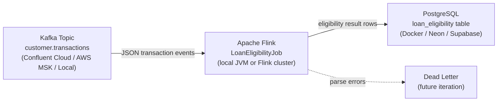
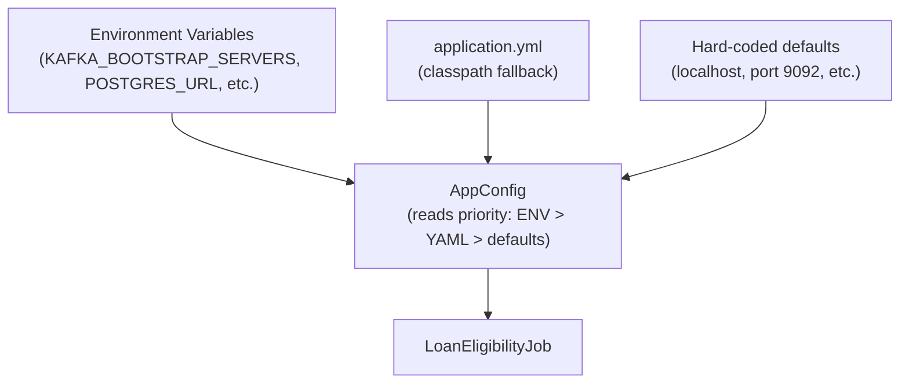

# Architecture

This document describes the high-level architecture of the **Loan Eligibility Flink Streaming** application.

---

## High-level flow



---

## Components

### 1. Kafka source — `customer.transactions`

Produces **JSON transaction events** representing customer activity in the mortgage/account domain.

Example payload:

```json
{
  "event_id":           "evt-1001",
  "customer_id":        "CUST123",
  "account_id":         "ACC999",
  "transaction_id":     "TXN001",
  "amount":             500.0,
  "currency":           "GBP",
  "transaction_status": "APPROVED",
  "account_status":     "ACTIVE",
  "transaction_time":   "2026-04-29T10:15:30Z"
}
```

Kafka cluster options (all supported by config only – no code change needed):

| Option            | Security protocol | SASL mechanism |
|-------------------|-------------------|----------------|
| Local Kafka       | `PLAINTEXT`       | —              |
| Confluent Cloud   | `SASL_SSL`        | `PLAIN`        |
| AWS MSK (IAM)     | `SASL_SSL`        | `AWS_MSK_IAM`  |
| AWS MSK (TLS)     | `SSL`             | —              |

---

### 2. Apache Flink — `LoanEligibilityJob`

The Flink DataStream job performs three operations:

1. **`KafkaSource`** – reads raw JSON strings from Kafka.
2. **`EligibilityMapFunction`** – parses JSON, applies the `LoanEligibilityRule`.
3. **`LoanEligibilityJdbcSink`** – batch-inserts results to PostgreSQL.

#### Loan eligibility rule (v1)

All four conditions must be true for `ELIGIBLE`:

| Condition                  | Default value |
|----------------------------|---------------|
| `amount >= threshold`      | 500.0         |
| `currency == required`     | GBP           |
| `transaction_status ==`    | APPROVED      |
| `account_status ==`        | ACTIVE        |

All thresholds are configurable via environment variables — see `AppConfig`.

---

### 3. PostgreSQL sink — `loan_eligibility`

The output table stores one row per processed transaction:

| Column                   | Type           | Notes                          |
|--------------------------|----------------|--------------------------------|
| `id`                     | BIGSERIAL PK   | auto-increment                 |
| `customer_id`            | VARCHAR(50)    | from Kafka event               |
| `account_id`             | VARCHAR(50)    | from Kafka event               |
| `transaction_id`         | VARCHAR(50)    | from Kafka event               |
| `transaction_amount_gbp` | NUMERIC(12,2)  | from Kafka event               |
| `transaction_currency`   | VARCHAR(10)    | from Kafka event               |
| `eligibility_status`     | VARCHAR(20)    | `ELIGIBLE` or `NOT_ELIGIBLE`   |
| `eligibility_reason`     | VARCHAR(255)   | human-readable explanation     |
| `loan_rule_version`      | VARCHAR(20)    | e.g. `v1` – for auditability   |
| `transaction_time`       | TIMESTAMPTZ    | original event timestamp       |
| `processed_at`           | TIMESTAMPTZ    | when Flink processed the event |

---

## Deployment variants

### Local development

```
[Confluent Cloud Kafka] --> [Flink (local JVM)] --> [PostgreSQL (Docker)]
```

Best for: getting started, development, demos.

### Cloud demo

```
[Confluent Cloud Kafka] --> [Flink (local or Confluent Cloud)] --> [PostgreSQL (Neon)]
```

Best for: shared demos, LinkedIn posts, no local infra.

### Production-like (AWS)

```
[AWS MSK] --> [Flink (Amazon Managed Service for Apache Flink)] --> [RDS PostgreSQL]
```

Best for: enterprise, production workloads.

---

## Configuration flow



---

## Source code layout

```
src/main/java/com/example/flink/
├── LoanEligibilityJob.java          # Main entry point
├── config/
│   └── AppConfig.java               # Env-var / YAML config reader
├── model/
│   ├── TransactionEvent.java        # Kafka input POJO
│   └── LoanEligibilityResult.java   # PostgreSQL output POJO
├── rule/
│   └── LoanEligibilityRule.java     # Eligibility rule evaluation
├── function/
│   └── EligibilityMapFunction.java  # Flink MapFunction (parse + evaluate)
└── sink/
    └── LoanEligibilityJdbcSink.java # JDBC sink factory
```
